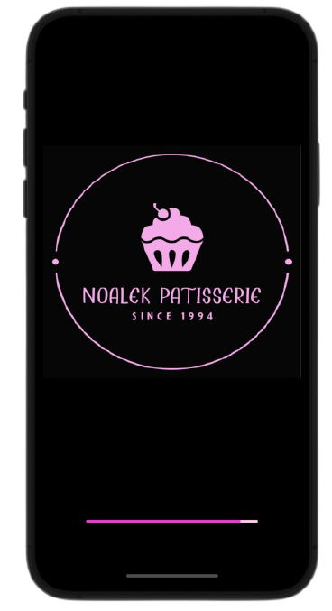

# Noalek Patisserie MENU - iOS Application 🍰

 

    
 

 

	This app is one place for all cakes and cookies made by Noalek Patisserie. 
Customers can be impressed by the delicious desserts, leave a comment and give a like. 
We plan to expand our functionality and thus support the shopping bag and payment system. 
Feel free to contact us for any future idea or feedback.  
Thanks ❤  

## App Functionality

1. Implementation of Users Identification and Users Registeration
	- Authentication and validation inputs of the users when entering the app.
	- Future logins to the app after registeration to the app will auto log in the user.
2. Implementation of Firebase Database Architecture
	- Data served by the app is handled by a RepositoryDataBase that implements Firebase.
	- Local data is saved in a singleton.
3. Implementation of Posts that can be edited only by admins.
4. Implamantation of Users Comments and Likes that can be edited only by the owner.

## Getting Started...

#### Installation
- Export git repository to Xcode
- Build and run the application on iOS emulator

Loading Page            | Login Page            |  Sign-Up Page
:-------------------------:|:-------------------------:|:-------------------------:
  |   |  

Main Feed            |  Product Details |  New Product
:-------------------------:|:-------------------------: |:-------------------------:
  |   |  

	
## Developed by:
* [**Guy Nudelman**](https://www.linkedin.com/in/guynudelman/)
* [**Noa Cohen**](https://www.linkedin.com/in/noalecohen1/)
