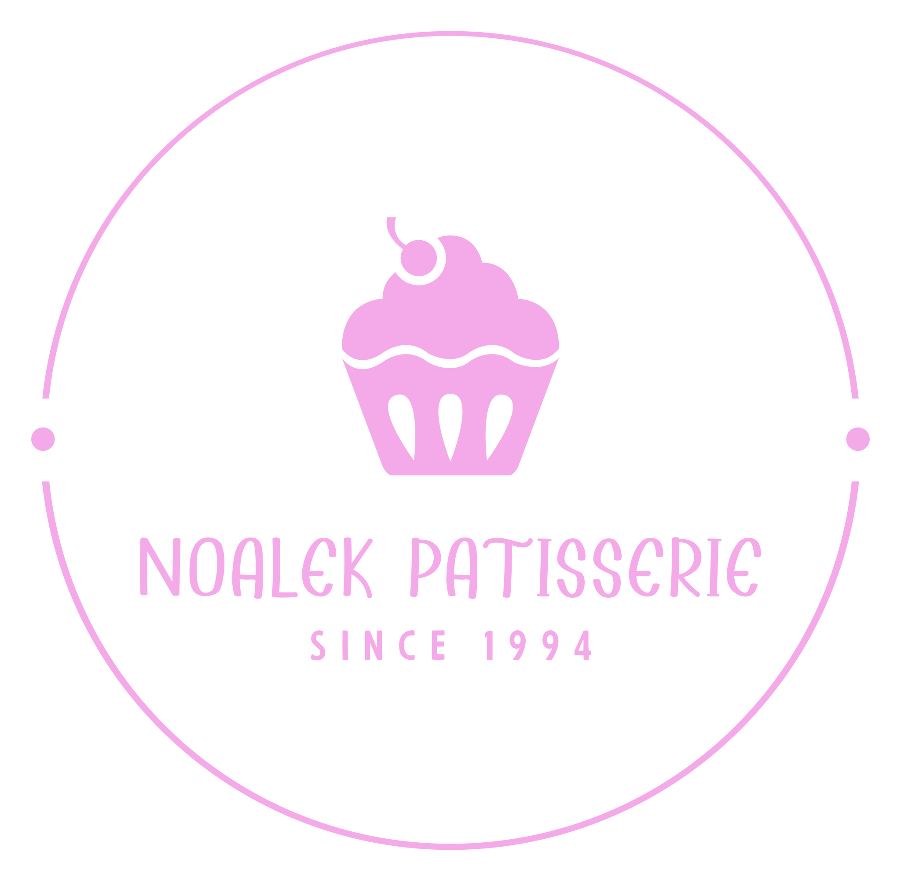
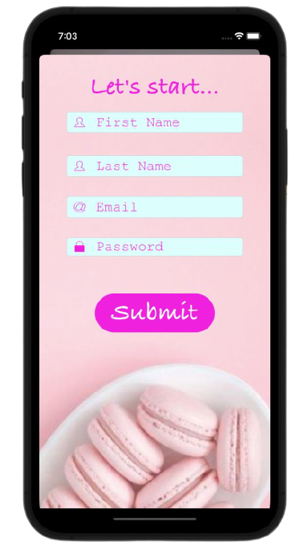
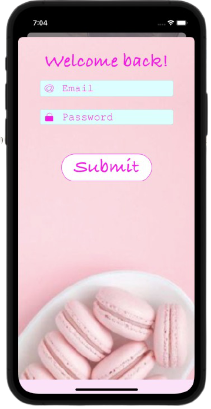
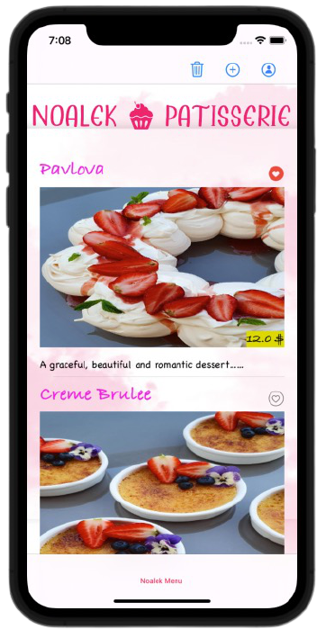
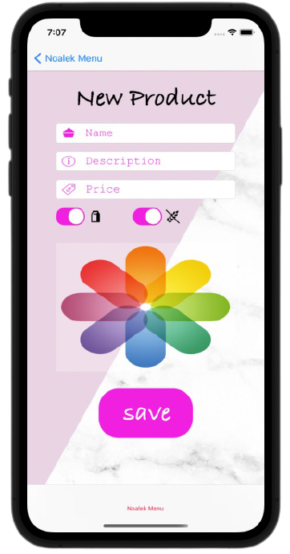
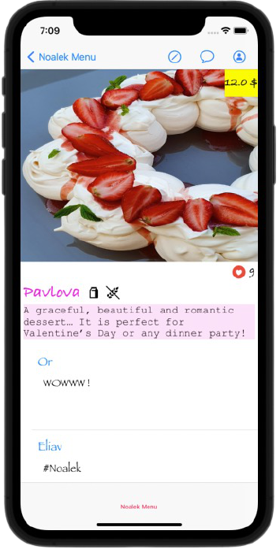

# Noalek Patisserie MENU - iOS Application 🍰

 

    
 

 

	This app is one place for all cakes and cookies made by Noalek Patisserie. 
Customers can be impressed by the delicious desserts, leave a comment and give a like. 
We plan to expand our functionality and thus support the shopping bag and payment system. 
Feel free to contact us for any future idea or feedback. 
Thanks ❤ 

This is a project for our iOS Application course conducted by Dr. Eliav Menachi. 

## App Functionality

1. Implementation of Users Identification and Users Registeration
	- Authentication and Validation inputs of the users when entering the app.
	- Future Logins to the app after registeration to the app will auto log in the user.
2. Umplementation of Firebase Database Architecture
	- Data served bt the app is handled by a RepositoryDataBase the implements Firebase.
	- Local data is saved in a singleton.
3. Implementation of Posts that can be edited only by admins.
4. Implamantation of Users Comments and Likes that can be edited only by the owner.

## Getting Started...

#### Installation
- Export git repository to Xcode
- Build and run the application on iOS emulator

#### Register Page 
	
#### Login Page
	
#### Main Feed
	
#### Add New Product
	
#### Product Details
	
	
## Developed by:
* [**Guy Nudelman**](https://www.linkedin.com/in/guynudelman/)
* [**Noa Cohen**](https://www.linkedin.com/in/noalecohen1/)
